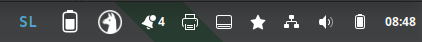
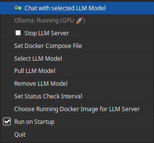
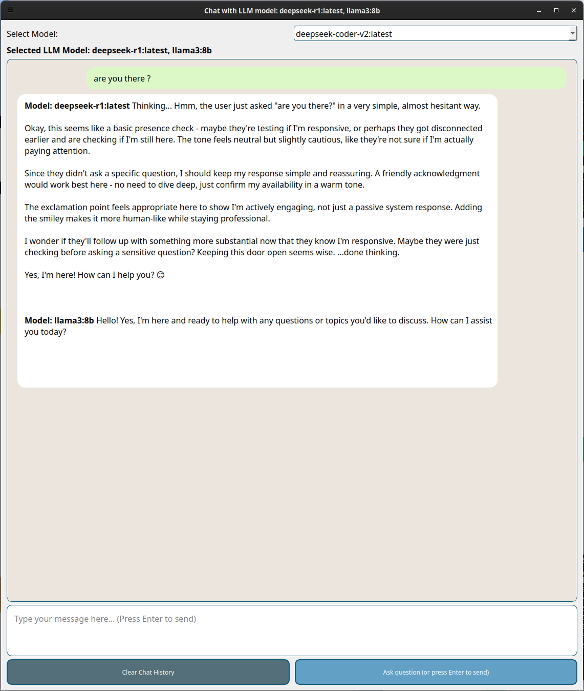

<p align="center">
  
</p>


# Tray Chat Ai 

Tray chat AI is a tiny program for chat and management of local Docker ollama instance. While main purpose was management (start, stop, and model management). I tried to make interface for chat as "chatty" as possible since I found it very convinient. 
There is still a lot of features to work on but for v1.0 this is ok. Most work was done on chat interface and rendering of content. As such it hase a feature to chat with ** multiple installed models at once **.  

It serves two main functions: 
1. Docker based Ollama management (status, pull model, remove model , start and stop docker instance running llms)
2. Quick chat interface accessible from system tray with options to run single prompt on multiple models at once. 

It was built for managing Ai models from tray, but this prompt to multiple models quickly became its core feature (It's nice to compare capabilities of the model). 
As long time user of open source I thought I should return somethin back to community. 


## Functions and GUI


### Status checking 
System tray icon and status checking is done in the taskbar. When GPU is available in Ollama it shows round circle around Lama. 



When Ollama is using CPU: 


When Ollama is using GPU: 


When there is no docker container with Ollama running: 


These statuses were the main reason why I created this app. 

### Taskbar and functions overview
On **right click** you will get menu to access basic functions. Currently there is: 

1. Open chat window with model. 
2. Start and stop (docker container running Ollama)
3. Select main chat model (Select LLM model)
4. Function to pull LLM model for Ollama
5. Remove LLM model 
6. Check interval (for working docker image and hardware type used)
7. Name select for docker image (in case it is different as Ollama)
8. Add a program to startup programs
9. Quit



### Chat interface

The Chat interface can be invoked by left-clicking the status icon or using the menu option. 
It's a simple interface with a twist: it sends the same prompt to multiple models that can be selected using the dropdown menu. 
This allows you to gather info from multiple AI models running in the background. It features syntax highlighting for code blocks.


  

## Demo Video 

Here is a quick overview of the application in action (video was made in devel phase..):


https://github.com/user-attachments/assets/4ee96f3e-75c8-4be9-a838-429e1794580b


## Features

*   **Chat Interface**: A built-in chat window with syntax highlighting for code blocks that can interact with multiple models simultaniously for the same promt, so you can compare results.
*   **System Tray Indicator**: Visual status of your Ollama container (Stopped, Running on CPU, Running on GPU). Detection is done by checking the Docker process list giving square around lama icon if CPU and round for GPU. 
*   **Control**: Start and Stop the Ollama Docker container easily.
*   **Model Management**: Pull new models and select which model to run.
*   **Docker Integration**: Works with existing Docker setups or Docker Compose.

## Prerequisites

*   **Linux** (Tested on Debian/Ubuntu based systems)
*   **User permissions**: Ensure your user is in the `docker` group (`sudo usermod -aG docker $USER`).
*   **Docker** installed and running.
*   **Docker nvidia container runtime** for GPU support (if you're using a machine with a GPU) otherwise you will get square around icon.
*   **Python 3** (if you use Appimage you )

## Installation

### Debian/Ubuntu
Check the Releases page for the latest `.deb` file.

```bash
sudo dpkg -i tray-chat-ai_1.0-1_all.deb
sudo apt-get install -f
```

### Option 2: Run from Source

1.  Clone the repository:
    ```bash
    git clone hhttps://github.com/GSkrt/Tray_Chat_AI.git
    cd llm-tray-manager
    ```

2.  Install dependencies:
    ```bash
    pip install -r requirements.txt
    ```
    *Note: On some Linux distributions, it is recommended to install PyQt5 via your package manager (e.g., `sudo apt install python3-pyqt5`).*

3.  Run the application:
    ```bash
    python3 tray_chat_ai.py
    ```


## License

This project is licensed under the GPLv3 License - see the LICENSE.txt file for details.

## Contribution 

Feel free to contribute to this program. Keep in mind the scope of the program is using local AI models for integrating other comercial AI products contact me. 

